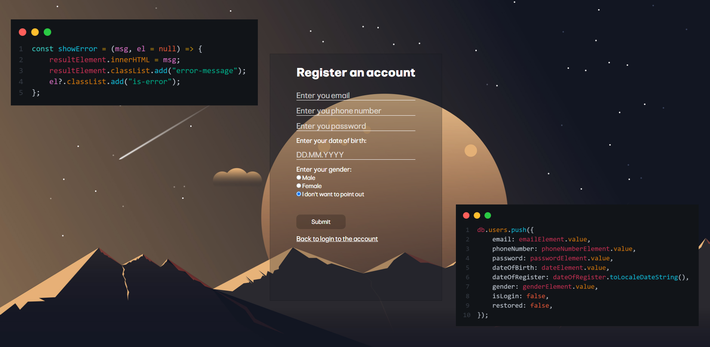
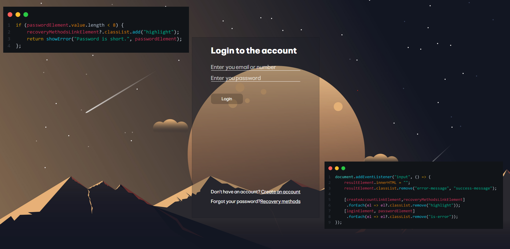
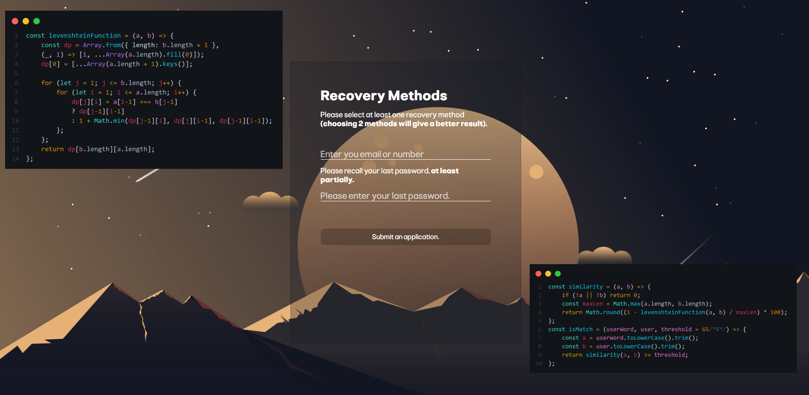

# About the Project
The website works dynamically, meaning you can register here and use these credentials for future logins. All data is saved in `Local Storage` on your device and is then used for authentication.  
### This is a simple authorization website with three features:
- Registration
- Login
- Recovery

# 💾Register system

### Features:
- Validation of email, password, and date of birth
- Checking if the email and phone number already exist in the database
- Saving data to LocalStorage

# 💽Login system

### Features:
- Validation of email and password correctness
- Search for a user simultaneously by email and phone number (optional / at choice)
- Adding the `isLogin: true` status upon successful login, which prevents repeated authorization (re-login)

# 🔎Recovery system

### Features:
- Validation of email correctness  
- Checking password similarity in percentages using [Levenshtein Distance](https://en.wikipedia.org/wiki/Levenshtein_distance): if the similarity is greater than 60%, return `true`  
  *(Note: You may think 60% is low, but remember that passwords are at least 8 characters long, and the longer the password, the harder it is to match the right word)*  
- Replacing the old password with a new one  
- Adding the property `restored: true`, which prevents repeated password recovery  

### ⚠️Note
Because the JavaScript code is divided into ES modules, you need to install the [Live Server](https://marketplace.visualstudio.com/items?itemName=ritwickdey.LiveServer) (or Local Host) plugin in your IDE to prevent incorrect behavior.
